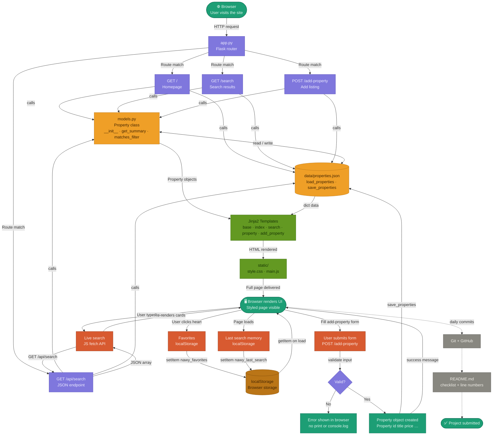

```mermaid
flowchart TD
    %% ── BROWSER ──
    A([🌐 Browser\nUser visits the site])

    %% ── FLASK ROUTER ──
    A -->|HTTP request| B[app.py\nFlask router]

    %% ── ROUTES ──
    B -->|Route match| C[GET /\nHomepage]
    B -->|Route match| D[GET /search\nSearch results]
    B -->|Route match| E[POST /add-property\nAdd listing]
    B -->|Route match| F[GET /api/search\nJSON endpoint]

    %% ── DATA LAYER ──
    C & D & E & F -->|calls| G[models.py\nProperty class\n__init__ · get_summary · matches_filter]
    C & D & E & F -->|calls| H[(data/properties.json\nload_properties · save_properties)]
    G <-->|read / write| H

    %% ── TEMPLATES ──
    G -->|Property objects| I[Jinja2 Templates\nbase · index · search · property · add_property]
    H -->|dict data| I

    %% ── STATIC ──
    I -->|HTML rendered| J[static/\nstyle.css · main.js]

    %% ── BROWSER RECEIVES PAGE ──
    J -->|Full page delivered| K([🖥️ Browser renders UI\nStyled page visible])

    %% ── JS LAYER ──
    K -->|User types filters| L[Live search\nJS fetch API]
    K -->|User clicks heart| M[Favorites\nlocalStorage]
    K -->|Page loads| N[Last search memory\nlocalStorage]

    L -->|GET /api/search| F
    F -->|JSON array| L
    L -->|Re-renders cards| K

    M -->|setItem nawy_favorites| O[(localStorage\nBrowser storage)]
    N -->|setItem nawy_last_search| O
    O -->|getItem on load| K

    %% ── FORM SUBMIT FLOW ──
    K -->|Fill add-property form| P[User submits form\nPOST /add-property]
    P -->|validate input| Q{Valid?}
    Q -->|No| R[Error shown in browser\nno print or console.log]
    Q -->|Yes| S[Property object created\nProperty id title price …]
    S -->|save_properties| H
    S -->|success message| K

    %% ── SUBMISSION ──
    K -.->|daily commits| T[Git + GitHub]
    T -.-> U[README.md\nchecklist + line numbers]
    U -.-> V([✅ Project submitted])

    %% ── STYLES ──
    classDef browser  fill:#1D9E75,stroke:#0F6E56,color:#E1F5EE
    classDef flask    fill:#7F77DD,stroke:#534AB7,color:#EEEDFE
    classDef data     fill:#EF9F27,stroke:#BA7517,color:#412402
    classDef static   fill:#639922,stroke:#3B6D11,color:#173404
    classDef js       fill:#D85A30,stroke:#993C1D,color:#FAECE7
    classDef storage  fill:#BA7517,stroke:#854F0B,color:#412402
    classDef success  fill:#1D9E75,stroke:#0F6E56,color:#E1F5EE
    classDef git      fill:#888780,stroke:#5F5E5A,color:#F1EFE8

    class A,K browser
    class B,C,D,E,F,Q flask
    class G,H data
    class I,J static
    class L,M,N,P js
    class O storage
    class R,S,V success
    class T,U git
```
