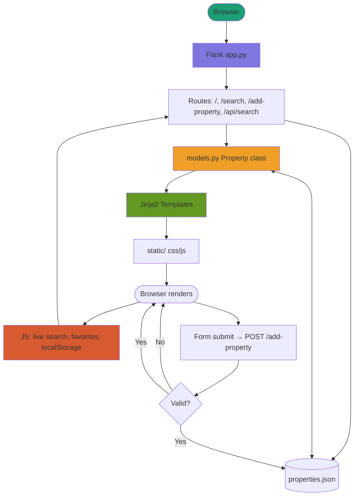

```mermaid
flowchart TD
    A([Browser]) --> B[Flask app.py]
    B --> C[Routes: /, /search, /add-property, /api/search]
    C --> D[models.py Property class]
    C --> E[(properties.json)]
    D <--> E
    D --> F[Jinja2 Templates]
    F --> G[static/ css/js]
    G --> H([Browser renders])
    
    H --> I[JS: live search, favorites, localStorage]
    I --> C
    
    H --> J[Form submit → POST /add-property]
    J --> K{Valid?}
    K -->|No| H
    K -->|Yes| E
    K -->|Yes| H
    
    style A fill:#1D9E75
    style B fill:#7F77DD
    style D fill:#EF9F27
    style F fill:#639922
    style I fill:#D85A30
```
